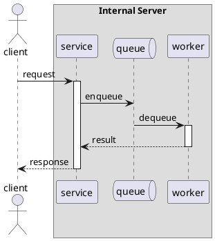
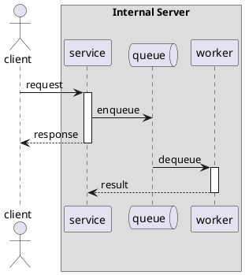
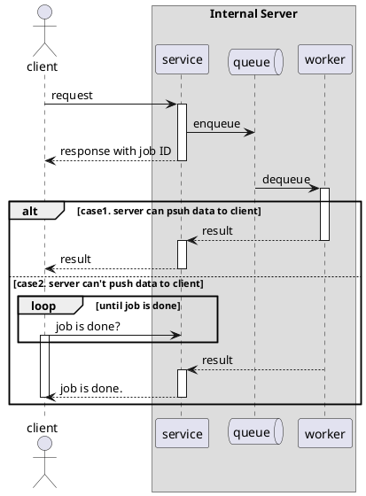

```plantuml
@startuml
actor       client 
box "Internal Server"
participant service
queue       queue
participant worker
end box

client -> service : request
activate service
service -> queue : enqueue
queue -> worker : dequeue
activate worker
worker --> service : result
deactivate worker
service --> client : response
deactivate service

@enduml
```

```plantuml
@startuml
actor       client 
box "Internal Server"
participant service
queue       queue
participant worker
end box

client -> service : request
activate service
service -> queue : enqueue
service --> client : response
deactivate service
queue -> worker : dequeue
activate worker
worker --> service : result
deactivate worker

@enduml
```

```plantuml
@startuml
actor       client 
box "Internal Server"
participant service
queue       queue
participant worker
end box

client -> service : request
activate service
service -> queue : enqueue
service --> client : response with job ID
deactivate service
queue -> worker : dequeue
activate worker

alt case1. server can psuh data to client
worker --> service : result
deactivate worker
activate service
service --> client : result
deactivate service
else case2. server can't push data to client

loop until job is done
client -> service : job is done?
activate client
end
worker --> service : result
deactivate worker
activate service
service --> client : job is done.
deactivate client
deactivate service
end
@enduml
```